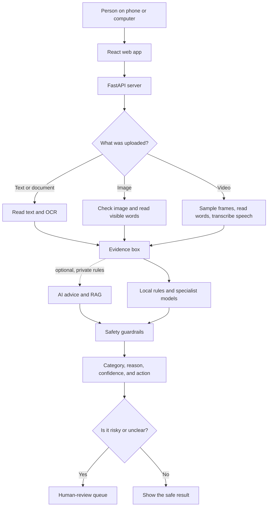

# TrustScopeAI

TrustScopeAI is a safety helper for online content. A person can give it text,
a document, an image, or a video. The tool collects the useful clues, chooses a
safety category, explains the reason, and sends difficult cases to a human.

> **Important:** this is a research and review tool, not a finished police,
> legal, medical, or automatic enforcement system. High-risk and uncertain
> decisions still need a qualified human.

## What we built

- One responsive web app that works in laptop, desktop, and mobile browsers.
- A Python API that accepts text, TXT, PDF, DOCX, JPG, PNG, WEBP, MP4, MOV,
  AVI, MKV, and WEBM files up to 100 MB.
- Text extraction, OCR, image checks, video-frame sampling, and local speech
  transcription.
- A shared rulebook with 19 moderation categories.
- Local rules and specialist models that look for different kinds of risk.
- Guardrails that stop one specialist from stealing another category's job.
- A human-review queue with an audit history.
- Optional server-side AI advice. The AI may add evidence or ask for review,
  but it cannot make an automatic Allow or Block decision by itself.
- Frozen candidate files and independent tests, so a failed test cannot be
  quietly changed after seeing the answers.

## Architecture diagram



In simple words: the app reads the content, puts all useful clues in one box,
asks several careful helpers, applies safety rules, and then shows the result.
An outside AI is only an adviser. It is never the boss.

## Results with actual numbers

### System checks

| What we measured | Actual result | What it means |
| --- | ---: | --- |
| Backend automated tests | **199/199 passed** | Every automated regression check passed in the last full run. |
| Test success rate | **100%** | 199 divided by 199. This is test success, not total real-world accuracy. |
| Local API requests | **95/95 succeeded** | Every request in the small performance check returned a valid moderation result. |
| Local request success rate | **100%** | No request failed in that 95-request check. |
| Simulated users | **1, 5, and 10** | Ten is the largest local group tested. It is not a production capacity promise. |
| Real production users measured | **0** | The project has no public production analytics yet. |
| Model warm-up | **17.18 seconds** | Time to start and warm six representative text paths on the test computer. |
| Frontend dependency audit | **0 known vulnerabilities** | npm audited 66 dependency entries after the security update. |

### Text response time

Measured on Windows with 12 logical CPU cores, Python 3.12.14, external AI
disabled, and all six example paths warmed first:

| Simulated users | Requests | Middle response | 95% response | Success |
| ---: | ---: | ---: | ---: | ---: |
| 1 | 20 | **210.35 ms** | **10.97 s** | **20/20 (100%)** |
| 5 | 25 | **677.00 ms** | **25.63 s** | **25/25 (100%)** |
| 10 | 50 | **1.45 s** | **51.39 s** | **50/50 (100%)** |

“Middle response” means half were faster and half were slower. “95% response”
means 95% of the requests in this small run finished at or below that time.
The large slow times show an important truth: the current local
model stack needs speed and concurrency work before production use.

This benchmark does not include browser/network delay, files, OCR, images,
videos, or optional external AI. The raw, reproducible numbers are in
[the performance snapshot](docs/PERFORMANCE_SNAPSHOT.json), and the command is:

```powershell
cd backend
python -m scripts.benchmark_readme_metrics
```

### Category results

The table uses the best honest measurement available for each category. A
synthetic test is a carefully made practice exam; it is not the same as the
messy real world.

| Category | Measured result | Examples | Current meaning |
| --- | --- | ---: | --- |
| Religiously Offensive Content | 100% synthetic accuracy | 240 | Passed guarded review-only gate. |
| Hate Speech & Discrimination | 88.19% precision; 39.44% recall | 2,170 external | Passed only for selective, high-confidence review. |
| Terrorism & Extremism | 100% synthetic accuracy | 300 | Passed guarded review routing; community names are not legal proof. |
| Violent Content | 91.25% synthetic accuracy | 80 | **Not ready** because a per-class gate failed. |
| Dangerous Content | 98.61% synthetic accuracy | 360 | Passed guarded review-only gate. |
| Graphic, Obscene & Sexual Content | 97.08% synthetic accuracy | 240 | Text/policy gate passed; captionless visual model still needs independent proof. |
| Sexual Harassment | 100% precision; 93.33% recall | 60 positive examples in a 240-record test | Passed the shared synthetic gate. |
| Cyberbullying & Harassment | 89.59% selective accuracy at 89.67% coverage | 300 external | Passed selective gate; unsure cases go to review. |
| Invasion of Privacy | 100% synthetic accuracy | 720 | Passed guarded local review routing. |
| Illegal Activities | 100% synthetic accuracy | 600 | Passed guarded review routing; not an automatic legal judgment. |
| Publishing Private Information | 91.45% recall | 2,000 positive-only | No negative-set accuracy proof yet. |
| Identity Theft & Impersonation | 58.33% synthetic accuracy; 20.83% recall | 192 | **Not ready.** |
| Misinformation & Fake News | 41.67% exact accuracy | 36 | **Not ready.** |
| Spam, Scam & Phishing | 99.22% external accuracy | 774 | Strong message-level evidence; full product proof is separate. |
| Intellectual Property Infringement | No dedicated result | 0 | **Not ready; this is the next category.** |
| Malicious Programs | 100% synthetic accuracy | 800 | Passed guarded, non-executing security review routing. |
| Abusive Words | 95% selective precision; 76% recall | 100 label-support examples | Passed selective review routing. |
| Child Exploitation | 100% synthetic accuracy | 720 | Passed a safe, high-level synthetic gate; no real exploitative media was used. |
| Normal/Ignore | No separate accuracy test | — | Returned only when no stronger category owns the case. |

Read the full evidence and its limits in the
[category-readiness ledger](docs/CATEGORY_READINESS_LEDGER.md). Read all 19
plain-language rules in [the moderation rulebook](docs/MODERATION_RULES.md).

## How a decision is made

1. Find usable clues in the text, document, image, or video.
2. Ask local rules and specialist models what those clues may mean.
3. Protect safe contexts such as reporting, education, prevention, or approved
   professional work.
4. Preserve the category that already owns the case.
5. If important evidence is missing, choose **Uncertain** and ask a human.
6. Store a small review record, not a secret key or unsafe payload.

## Important improvements and bugs we fixed

- The phone app no longer assumes that the API lives on the phone itself; it
  can use the laptop's private-network address.
- Private-network browser access uses a controlled CORS rule instead of `*`.
- The PWA cache keeps only the app shell; it does not cache submissions or
  moderation answers.
- AI output must match a strict shape. Broken or invented output is rejected.
- Safe context no longer erases an already confirmed high-risk category.
- Category-owner guards stop unrelated specialists from changing a decision.
- Unknown age, consent, identity, licence, legal status, or provenance cannot
  be guessed by a model.
- Graphic violence that lacks a ready violence specialist fails safely to
  human review instead of being mislabeled as bullying or dangerous content.
- Legitimate jobs, research, reporting, warnings, art, and education received
  explicit boundaries to reduce false alarms.
- Early candidates that failed independent tests stayed frozen; improved
  versions were built from aggregate lessons and tested on fresh examples.
- The frontend's transitive NanoID package was moved from vulnerable 3.3.17 to
  patched 3.3.18. The npm audit changed from four high-severity findings to
  zero. See the [official advisory](https://github.com/advisories/GHSA-2v37-7h3g-55p8).
- The documentation benchmark now tolerates Windows briefly holding its
  temporary SQLite file after concurrent requests finish.

## Why we chose these tools

The short answer is: React makes the screen, FastAPI receives requests, Python
runs the safety logic, local models find patterns, SQLite keeps the review
queue, and Pytest checks that old behavior does not break.

The detailed reasons and trade-offs are in
[Technical Decisions](docs/TECHNICAL_DECISIONS.md).

## Keep API keys private

- Put a real provider key only in a local `.env` file or a secret manager.
- `.env`, `backend/.env`, `frontend/.env`, key files, credentials, logs, local
  databases, uploads, model caches, reports, and private holdouts are ignored
  by Git.
- The frontend must never contain a provider key. Browser code is visible to
  everyone who opens the page.
- `.env.example` contains names and empty placeholders only.
- Before this update, both tracked files and reachable Git history were scanned
  for common live-key patterns. No live credential pattern was found.
- If a real key was ever pasted into a chat, issue, screenshot, or public page,
  revoke it and create a new one. Hiding it later is not enough.

## Run it on Windows

From the project folder:

```powershell
.\start_trustscope.ps1
```

The launcher prints the laptop address and the phone address for devices on the
same trusted Wi-Fi network. Stop it with:

```powershell
.\stop_trustscope.ps1
```

See [Cross-device setup](docs/CROSS_DEVICE_SETUP.md) for manual and production
instructions.

## What is not finished

- Production login, permissions, HTTPS, rate limiting, retention rules, and
  security review are still required.
- Ten simulated users is only a small local check, not a promise about scale.
- Image and video understanding still has unvalidated boundaries.
- Several categories in the results table are not independently ready.
- Human reviewers still make high-risk, identity, consent, ownership, licence,
  legal, and provenance judgments.

## Next category

The next planned category is **Intellectual Property Infringement**. It will
look for a protected work plus credible evidence of unauthorized copying,
distribution, sale, access, or counterfeiting. A title, logo, style, or user
claim alone will not be treated as proof. Licences, original work, public-domain
material, quotation, parody, criticism, fair use, and unclear ownership will be
handled carefully and sent to qualified human review when needed.
