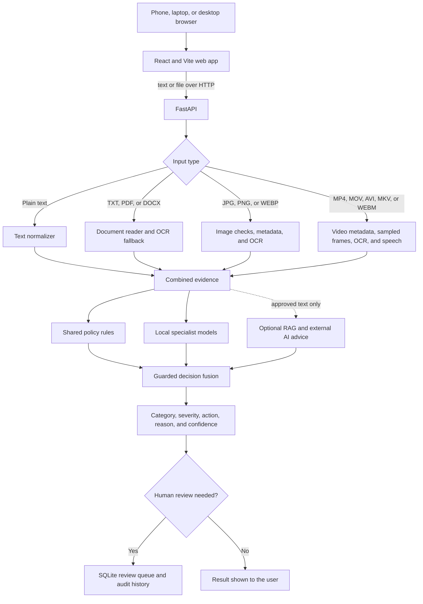
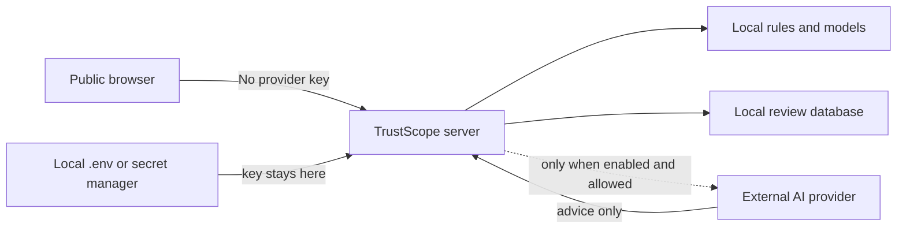

# TrustScopeAI architecture

Updated: 2026-09-07

## The whole system

## What each layer does

1. **The web app** lets a person paste text or choose a file. It works on a
   computer or a phone browser.
2. **The API** checks the request and sends it to the correct reader.
3. **The readers** turn documents, visible words, video frames, and speech into
   evidence the moderation system can use.
4. **The policy and model layer** looks for risk while protecting safe contexts
   such as reporting, education, prevention, and approved work.
5. **Guarded fusion** keeps category ownership stable and prevents an optional
   AI from becoming an enforcement engine.
6. **The result layer** explains the category and next action. Risky or unclear
   cases are saved for a human reviewer.

## Trust boundaries

- A provider key stays on the server and never enters the browser bundle.
- Child-safety, private, or security-sensitive evidence is stopped before the
  optional external-advice path when its policy forbids transmission.
- Moderation responses, uploads, review databases, private holdouts, and raw AI
  output are excluded from Git.
- The external AI cannot create automatic Allow, Block, identity, age, consent,
  licence, legal-status, or provenance findings.
- Automatic enforcement is disabled.

## Current scaling boundary

The current SQLite queue and in-process local models are appropriate for a
laptop research prototype. A small benchmark completed 95/95 text requests and
tested up to 10 simulated users, but response times became much slower under
concurrency. Production should add authenticated users, a managed database,
background task queues, model workers, rate limits, monitoring, and HTTPS.

See [the performance snapshot](PERFORMANCE_SNAPSHOT.json) for the measured
numbers and [Technical Decisions](TECHNICAL_DECISIONS.md) for the reasons behind
the design.
